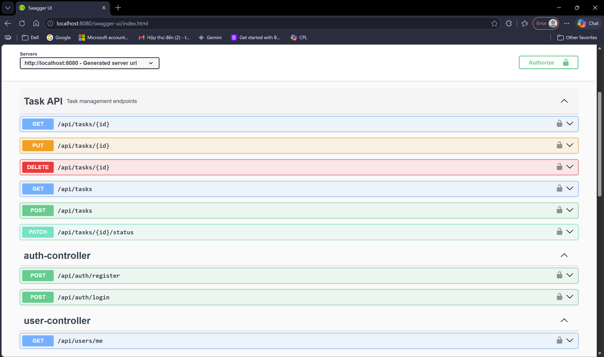

# Task Manager REST API

A backend RESTful API built with Spring Boot for managing personal tasks securely using JWT Authentication and Spring Security.

This project was developed to practice real-world backend development concepts such as authentication, authorization, CRUD operations, validation, exception handling, pagination, and layered architecture.

---

# Project Goals

The purpose of this project is to:

- Practice building scalable RESTful APIs using Spring Boot
- Implement JWT Authentication and Spring Security
- Apply layered architecture for maintainable backend development
- Handle validation and exception responses properly
- Practice pagination, filtering, and task management workflows
- Improve API documentation using Swagger/OpenAPI

---

# Swagger API Overview



---

# Features

- User Authentication (Register/Login)
- JWT-based Authorization
- Task CRUD APIs
- Search Tasks by Title
- Pagination & Sorting
- Request Validation
- Global Exception Handling
- Swagger/OpenAPI Documentation
- Layered Architecture

---

# Tech Stack

- Java 17
- Spring Boot
- Spring Security
- JWT Authentication
- Spring Data JPA / Hibernate
- SQL Server
- Maven
- Swagger / OpenAPI
- Lombok

---

# Project Structure

```text
src/main/java/com/example/taskmanager
│
├── controller
├── service
├── repository
├── dto
├── entity
├── security
├── exception
└── config
```

---

# Authentication

The API uses:

- Spring Security
- JWT Authentication
- BCrypt Password Encoder

Protected APIs require:

```http
Authorization: Bearer <your_token>
```

---

# API Endpoints

## Authentication APIs

| Method | Endpoint | Description |
|---|---|---|
| POST | `/api/auth/register` | Register new user |
| POST | `/api/auth/login` | Login and receive JWT token |

## User APIs

| Method | Endpoint | Description |
|---|---|---|
| GET | `/api/users/me` | Get current authenticated user |

## Task APIs

| Method | Endpoint | Description |
|---|---|---|
| GET | `/api/tasks` | Get paginated tasks |
| GET | `/api/tasks/{id}` | Get task by ID |
| POST | `/api/tasks` | Create new task |
| PUT | `/api/tasks/{id}` | Update task |
| PATCH | `/api/tasks/{id}/status` | Update task status |
| DELETE | `/api/tasks/{id}` | Delete task |

---

# Pagination & Search

Example:

```http
GET /api/tasks?page=0&size=5&sortBy=createdAt&sortDirection=desc&keyword=spring
```

---

# Database

- SQL Server
- Users & Tasks relationship

---

# Setup Instructions

## Clone Repository

```bash
git clone https://github.com/tuananh-25/springboot-task-manager.git
```

## Configure Database

Update:

```text
src/main/resources/application.yml
```

Example:

```yml
spring:
  datasource:
    url: jdbc:sqlserver://localhost:1433;databaseName=database_name;encrypt=true;trustServerCertificate=true
    username: your_username
    password: your_password
    driver-class-name: com.microsoft.sqlserver.jdbc.SQLServerDriver

  jpa:
    hibernate:
      ddl-auto: update

    show-sql: true

    properties:
      hibernate:
        format_sql: true

server:
  port: 8080

jwt:
  secret-key: your_secret_key
  expiration: 86400000
```

## Run Application

```bash
mvn spring-boot:run
```

Application runs at:

```text
http://localhost:8080
```

---

# Validation & Exception Handling

Implemented:

- Jakarta Validation
- Global Exception Handler
- Custom Error Responses

---

# Future Improvements

- Thymeleaf + Bootstrap UI
- Docker Support
- Unit Testing
- Refresh Token
